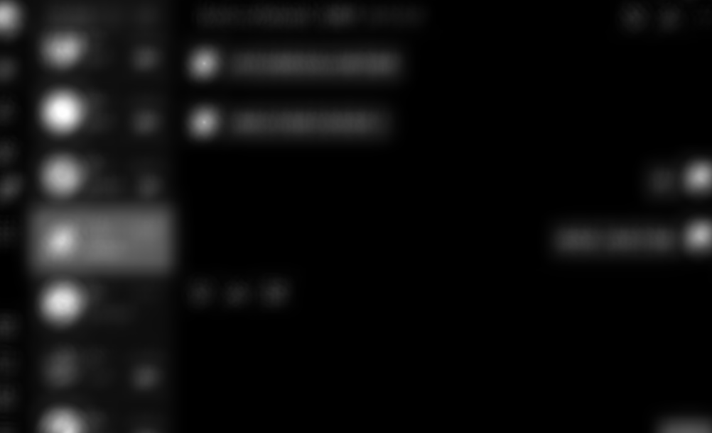

测试rust下的模板匹配，结果不太理想。

原图：

模板:

下面是imageproc内置的匹配算法的四种选项：

## CrossCorrelation

这张烂完了，没什么参考价值

## CrossCorrelationNormalized

这张很奇怪，按理说目标的中心点的深度应该比较大，但结构是反的

## SumOfSquaredErrors

肉眼看来最好的一张，虽说把另一个头像也放进去了，但识别的数据也是灰度值，所以情有可原

## SumOfSquaredErrorsNormalized

不如上一个